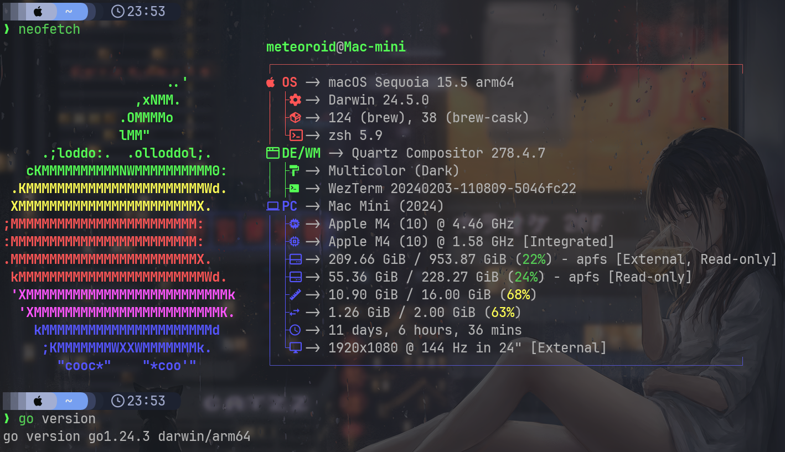
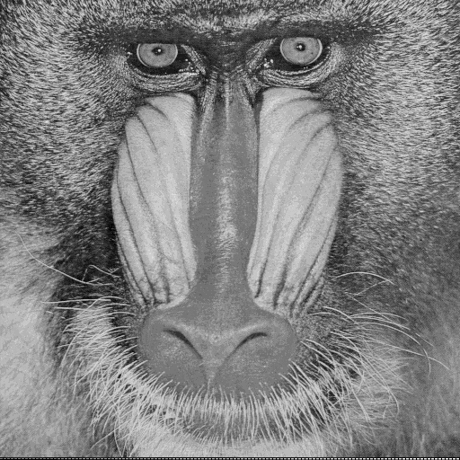

<!-- paginate: skip -->
<br>
<h1><center>多媒體安全 - 期末報告<center></h1>

<br>
<br>
<br>
<br>
<br>
<h3><center>電通三乙<br>C111110233 余明耀</center></h3>

---
<!-- paginate: true -->
##  系統環境介紹


---
## 專案結構
```
secretmerger
├── cmd
│   ├── main
│   │   └── main.go
│   └── test
│       └── main.go
├── go.mod
├── internal
│   ├── imageio
│   │   ├── bmp.go
│   │   └── utils.go
│   └── process
│       ├── combine.go
│       ├── psnr.go
│       └── reverse.go
├── output
│   ├── Z_combined.bmp
│   ├── Z_double_reversed.bmp
│   └── Z_reversed.bmp
└── testdata
    ├── baboon_gray.bmp
    ├── F16_gray.bmp
    ├── Lena_gray.bmp
    └── peppers_gray.bmp
```

---
## 位元反轉 `internal/process/reverse.go`
```go
// ReverseByte 反轉一個 byte 的 bit 順序
func ReverseByte(b byte) byte {
	var r byte = 0
	for i := 0; i < 8; i++ {
		r <<= 1 // r 左移
		r |= b & 1 // 取 b 最右邊的 bit (b & 1) 放到 r 最右邊的 bit (r |= ...) 
		b >>= 1 // b 右移
	}
	return r
}
// ReverseBits 反轉一個 byte 的 bit 順序，並保存成 B4B5B6B7 0000
func ReverseBits(b byte) byte {
	var r byte = 0
	for i:= 0; i < 8; i++ {
		r <<= 1
		r |= b & 1
		b >>= 1
	}
	r <<= 4
	return r
}
```

---
## 更改整張圖片 `internal/process/reverse.go`
```go
// ReverseImageBits 對每個像素的 bit 順序做反轉（僅支援灰階圖）
func ReverseImageBits(img *image.Gray) *image.Gray {
	bounds := img.Bounds()
	newImg := image.NewGray(bounds)

	for y := bounds.Min.Y; y < bounds.Max.Y; y++ {
		for x := bounds.Min.X; x < bounds.Max.X; x++ {
			orig := img.GrayAt(x, y).Y
			newVal := ReverseByte(orig)
			newImg.SetGray(x, y, color.Gray{Y: newVal})
		}
	}
	return newImg
}
```

---
## 組合圖片 `internal/process/combine.go`
```go
// Combine 將兩張灰階影像 X 和 Y 合併為 Z
func Combine(x, y *image.Gray) *image.Gray {
    if x.Bounds() != y.Bounds() {
        panic("images must have the same dimensions")
    }

    bounds := x.Bounds()
    z := image.NewGray(bounds)

    for yCoord := bounds.Min.Y; yCoord < bounds.Max.Y; yCoord++ {
        for xCoord := bounds.Min.X; xCoord < bounds.Max.X; xCoord++ {
            xPixel := x.GrayAt(xCoord, yCoord).Y
            yPixel := y.GrayAt(xCoord, yCoord).Y
            yPixel = ReverseBits(yPixel)

            // 合併
            zPixel := (xPixel & 0xF0) | (yPixel >> 4)
            z.SetGray(xCoord, yCoord, color.Gray{Y: zPixel})
        }
    }

    return z
}
```

---
## 計算 PSNR `internal/process/psnr.go`
```go
// PSNR 計算輸入影像與參考影像的 PSNR 值
func PSNR(img *image.Gray) float64 {
	if referenceImage == nil {
		panic("reference image is not set")
	}
	if img.Bounds() != referenceImage.Bounds() {
		panic("images must have the same dimensions")
	}

	var mse float64
	bounds := img.Bounds()

	for y := bounds.Min.Y; y < bounds.Max.Y; y++ {
		for x := bounds.Min.X; x < bounds.Max.X; x++ {
			diff := float64(img.GrayAt(x, y).Y) - float64(referenceImage.GrayAt(x, y).Y)
			mse += diff * diff
		}
	}

	mse /= float64(bounds.Dx() * bounds.Dy())
	if mse == 0 {
		return math.Inf(1) // 無限大，表示完全相同
	}

	return 10 * math.Log10(255*255/mse)
}
```

---
## 讀取圖片 `internal/imageio/bmp.go`
```go
const bmpHeaderSize = 54 // BMP header size

func ReadGrayBMP(path string) ([]byte, []byte, error) {
	file, err := os.ReadFile(path)
	if err != nil {
		return nil, nil, err
	}

	if len(file) < bmpHeaderSize {
		return nil, nil, fmt.Errorf("not a valid BMP file")
	}

	header := file[:bmpHeaderSize]
	pixels := file[bmpHeaderSize:]
	return header, pixels, nil
}
```
---
## 存儲圖片 `internal/imageio/bmp.go`
```go
func WriteGrayBMP(path string, header, pixels []byte, width int, height int) error {
    // 添加調色板
    palette := make([]byte, paletteSize)
    for i := 0; i < 256; i++ {
        palette[i*4] = byte(i)     // B
        palette[i*4+1] = byte(i)   // G
        palette[i*4+2] = byte(i)   // R
        // i*4+3 保持0
    }
    
    // 計算行填充
    bytesPerRow := width
    padding := (4 - (bytesPerRow % 4)) % 4
    paddedPixels := make([]byte, 0, len(pixels) + (padding * height))
    
    // 重新排列像素並添加填充
    for y := 0; y < height; y++ {
        start := y * width
        end := start + width
        paddedPixels = append(paddedPixels, pixels[start:end]...)
        paddedPixels = append(paddedPixels, make([]byte, padding)...)
    }
    
    // 組合最終文件
    fullHeader := append(header[:bmpHeaderSize], palette...)
    return os.WriteFile(path, append(fullHeader, paddedPixels...), 0644)
}
```

---
## 主程式邏輯 `cmd/main/main.go`
```go
func main() {
	inputY := "testdata/peppers_gray.bmp"
	inputX := "testdata/baboon_gray.bmp"
	outputZ := "output/Z_combined.bmp"
	outputReversed := "output/Z_reversed.bmp"
	outputDoubleReversed := "output/Z_double_reversed.bmp"
	// 讀取 X 和 Y 影像
	headerX, pixelsX, err := imageio.ReadGrayBMP(inputX)
	if err != nil {
		panic(err)
	}
	headerY, pixelsY, err := imageio.ReadGrayBMP(inputY)
	if err != nil {
		panic(err)
	}

	// 確保兩張影像大小相同
	widthX := int(headerX[18]) | int(headerX[19])<<8 | int(headerX[20])<<16 | int(headerX[21])<<24
	heightX := int(headerX[22]) | int(headerX[23])<<8 | int(headerX[24])<<16 | int(headerX[25])<<24
	widthY := int(headerY[18]) | int(headerY[19])<<8 | int(headerY[20])<<16 | int(headerY[21])<<24
	heightY := int(headerY[22]) | int(headerY[23])<<8 | int(headerY[24])<<16 | int(headerY[25])<<24

	if widthX != widthY || heightX != heightY {
		panic("Images X and Y must have the same dimensions")
	}

	// 將像素轉換為 *image.Gray
	imgX := &image.Gray{
		Pix:    pixelsX,
		Stride: widthX,
		Rect:   image.Rect(0, 0, widthX, heightX),
	}
	imgY := &image.Gray{
		Pix:    pixelsY,
		Stride: widthY,
		Rect:   image.Rect(0, 0, widthY, heightY),
	}
}
```

---
## 主程式邏輯(續) `cmd/main/main.go`
```go
func main() {
// 合併 X 和 Y 成 Z
	imgZ := process.Combine(imgX, imgY)

	// 對 Z 進行一次反轉
	reversedZ := process.ReverseImageBits(imgZ)

	// 再次反轉 Z
	doubleReversedZ := process.ReverseImageBits(reversedZ)

	// 保存 Z 、反轉後的 Z 和兩次反轉的 Z
	if err := imageio.WriteGrayBMP(outputZ, headerX, imgZ.Pix, widthX, heightX); err != nil {
		panic(err)
	}
	if err := imageio.WriteGrayBMP(outputReversed, headerX, reversedZ.Pix, widthX, heightX); err != nil {
		panic(err)
	}
	if err := imageio.WriteGrayBMP(outputDoubleReversed, headerX, doubleReversedZ.Pix, widthX, heightX); err != nil {
		panic(err)
	}
}
```

---
## 原圖
<!-- slide -->

<style>
.flex {
  display: flex;
  gap: 140px;
}
.flex img {
  width: 500px;
}
</style>

<div class="flex">
  <div>
    
    <small>這是載體圖</small>
  </div>
  <div>
    
    <small>這是隱藏圖</small>
  </div>
</div>

---
## 合併後
<!-- slide -->

<style>
.flex {
  display: flex;
  gap: 140px;
}
.flex img {
  width: 500px;
}
</style>

<div class="flex">
  <div>
    
    <small>反轉前</small>
  </div>
  <div>
    
    <small>反轉後</small>
  </div>
</div>

---
<!-- paginate: skip -->
<br>
<br>
<br>
<h1><center>Thank<center></h1>
<h1><center>You<center></h1>